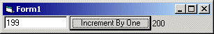

<div align="center">

## RGCC \- Challenge1 Entry


</div>

### Description

This is in response to the RGCC challenge 1, posted by Bruce Pierson. This code increments a number by one.
 
### More Info
 


<span>             |<span>
---                |---
**Submitted On**   |
**By**             |[Stephen Kent](https://github.com/Planet-Source-Code/PSCIndex/blob/master/ByAuthor/stephen-kent.md)
**Level**          |Intermediate
**User Rating**    |4.5 (18 globes from 4 users)
**Compatibility**  |VB 6\.0
**Category**       |[Jokes/ Humor](https://github.com/Planet-Source-Code/PSCIndex/blob/master/ByCategory/jokes-humor__1-40.md)
**World**          |[Visual Basic](https://github.com/Planet-Source-Code/PSCIndex/blob/master/ByWorld/visual-basic.md)
**Archive File**   |[](https://github.com/Planet-Source-Code/stephen-kent-rgcc-challenge1-entry__1-24870/archive/master.zip)


### Source Code

```
'/////////////////////////////////////////////
'Form
Option Explicit
Const ArbitraryString = "Me, Myself, and I"
Const IDLength = 255
Const ValidSessionChars = "0123456789ABCDEFGHIJKLMNOPQRSTUVWXYZ"
Private Sub cmdIncrementByOne_Click()
  lblFunctionOutput = IncrementByOne(Val(txtOrigNumber.Text))
End Sub
Private Function IncrementByOne(ByVal OrigNumber As Double) As Double
  Dim ValueOfOne As String
  Dim MyID As String
  Dim MyKey As String
  Dim MySecondKey As String
  Dim objCrypt As clsRC4
  Dim objCrypt2 As clsRC4
  Dim CryptedID As String
  Dim EncryptedNum As String
  Dim IncrementedNum As Double
  MyID = GenerateRandomID(ArbitraryString)
  MyKey = GenerateRandomID(MyID)
  Set objCrypt = New clsRC4
  objCrypt.Key = MyKey
  MySecondKey = objCrypt.Crypt(MyID)
  Set objCrypt2 = New clsRC4
  objCrypt2.Key = MySecondKey
  CryptedID = objCrypt2.Crypt(MyID)
  EncryptedNum = objCrypt2.Crypt(CStr(OrigNumber))
  ValueOfOne = objCrypt.Crypt(CStr(Max(Asc(Mid(CryptedID, Int(Rnd * IDLength) + 1, 1)) Mod 2, 1)))
  IncrementedNum = Val(objCrypt2.Crypt(EncryptedNum)) + Val(objCrypt.Crypt(ValueOfOne))
  IncrementByOne = IncrementedNum
End Function
Function Max(ByVal First, ByVal Second)
  If First > Second Then
    Max = First
  Else
    Max = Second
  End If
End Function
'Function to generate Unique (hopefully) IDs based on the current Time/Date and UserName
Function GenerateRandomID(ByVal User)
  Dim Working
  Dim CurTime
  Dim Transfer
  Dim Length
  Dim i
  'Start off by using the current Time/Date as a number
  CurTime = CStr(CDbl(Now))
  'Use a Timer based Seed For a better random
  Randomize
  'Initialize the String to NullString (we don't want to take chances on invalid info.
  Working = vbNullString
  'Now we start by creating the Random ID based off the current time randomized
  For i = 1 To Len(CurTime)
    Working = Working & Mid(ValidSessionChars, ((Int((Rnd * Len(ValidSessionChars)) + 1) Xor Asc(Mid(CurTime, i, 1))) Mod Len(ValidSessionChars)) + 1, 1)
  Next
  'Now we use each character of the UserName the get random characters from our Allowable list and add then to the ID
  For i = 1 To Len(User)
    Working = Working & Mid(ValidSessionChars, ((Int((Rnd * Len(ValidSessionChars)) + 1) Xor Asc(Mid(User, i, 1))) Mod Len(ValidSessionChars)) + 1, 1)
  Next
  'Now we need to filter out any bad characters that got in (Should not be any)
  Transfer = ""
  For i = 1 To Len(Working)
    If (InStr(1, ValidSessionChars, Mid(Working, i, 1)) > 0) Then
      Transfer = Transfer & Mid(Working, i, 1)
    End If
  Next
  Working = Transfer
  'Now we do some tests to make sure we are generate a fixed length ID
  Select Case True
    Case (Len(Working) < IDLength)
      'Generate the extra characters randomly using the existing part of the ID as seeds
      Length = Len(Working)
      For i = (Length + 1) To IDLength
        Working = Working & Mid(ValidSessionChars, Int((Rnd * Len(ValidSessionChars)) + 1), 1)
      Next
    Case (Len(Working) > IDLength)
      'Truncate the ID down to valid Length
      Working = Mid(Working, 1, IDLength)
  End Select
  'Return what we generated.
  GenerateRandomID = Working
End Function
'/////////////////////////////////////////////
'clsRC4 Class
Option Explicit
Private mStrKey
Private mBytKeyAry(255)
Private mBytCypherAry(255)
Private Sub InitializeCypher()
  Dim lBytJump
  Dim lBytIndex
  Dim lBytTemp
  For lBytIndex = 0 To 255
    mBytCypherAry(lBytIndex) = lBytIndex
  Next
  ' Switch values of Cypher arround based off of index and Key value
  lBytJump = 0
  For lBytIndex = 0 To 255
    ' Figure index To switch
    lBytJump = (lBytJump + mBytCypherAry(lBytIndex) + mBytKeyAry(lBytIndex)) Mod 256
    ' Do the switch
    lBytTemp = mBytCypherAry(lBytIndex)
    mBytCypherAry(lBytIndex) = mBytCypherAry(lBytJump)
    mBytCypherAry(lBytJump) = lBytTemp
  Next
End Sub
Public Property Let Key(ByRef pStrKey)
  Dim lLngKeyLength
  Dim lLngIndex
  If pStrKey = mStrKey Then Exit Property
  lLngKeyLength = Len(pStrKey)
  If lLngKeyLength = 0 Then Exit Property
  mStrKey = pStrKey
  lLngKeyLength = Len(pStrKey)
  For lLngIndex = 0 To 255
    mBytKeyAry(lLngIndex) = Asc(Mid(pStrKey, ((lLngIndex) Mod (lLngKeyLength)) + 1, 1))
  Next
End Property
Public Property Get Key()
  Key = mStrKey
End Property
Public Function Crypt(ByRef pStrMessage)
  Dim lBytIndex
  Dim lBytJump
  Dim lBytTemp
  Dim lBytY
  Dim lLngT
  Dim lLngX
  ' Validate data
  If Len(mStrKey) = 0 Then Exit Function
  If Len(pStrMessage) = 0 Then Exit Function
  Call InitializeCypher
  lBytIndex = 0
  lBytJump = 0
  For lLngX = 1 To Len(pStrMessage)
    lBytIndex = (lBytIndex + 1) Mod 256 ' wrap index
    lBytJump = (lBytJump + mBytCypherAry(lBytIndex)) Mod 256 ' wrap J+S()
    ' Add/Wrap those two
    lLngT = (mBytCypherAry(lBytIndex) + mBytCypherAry(lBytJump)) Mod 256
    ' Switcheroo
    lBytTemp = mBytCypherAry(lBytIndex)
    mBytCypherAry(lBytIndex) = mBytCypherAry(lBytJump)
    mBytCypherAry(lBytJump) = lBytTemp
    lBytY = mBytCypherAry(lLngT)
    ' Character Encryption ...
    Crypt = Crypt & Chr(Asc(Mid(pStrMessage, lLngX, 1)) Xor lBytY)
  Next
End Function
```

